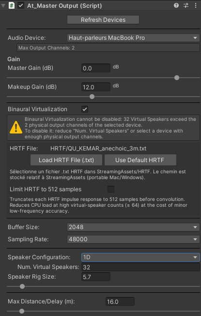
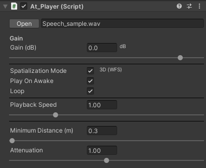
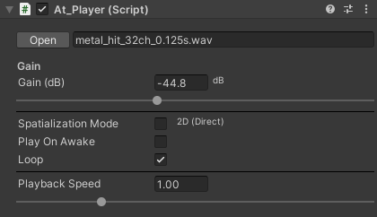
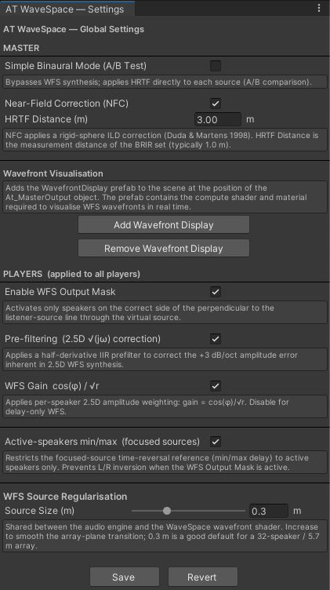
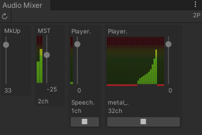
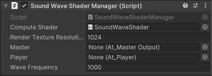
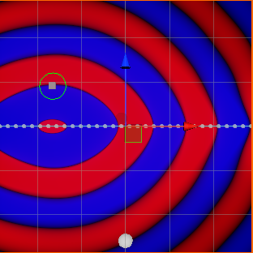
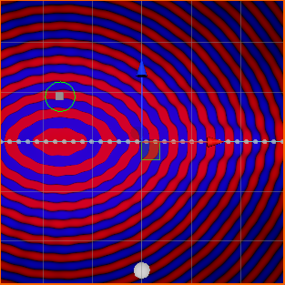
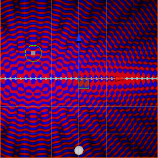

<p align="left">
  
</p>

# Wave Field Synthesis Audio Engine

> High-precision spatial audio for Unity, powered by Wave Field Synthesis.

[](LICENSE)
[](#)
[](#)
[](#)

---

## Overview

<table><tr>
<td width="45%" valign="top"></td>
<td valign="middle">

**AT WaveSpace** is a native spatial audio engine based on **Wave Field Synthesis (WFS)**, developed by Antoine Gonot at the [CNRS-LMA](https://www.lma.cnrs-mrs.fr/) laboratory in Marseille, France.

It enables physically grounded 3D sound field reproduction inside Unity using a high-performance **C++ / JUCE DSP core**, exposed to Unity through a pure **C API** (`extern "C"`) and a **C# wrapper layer**.

The engine targets multi-speaker WFS arrays (line / circle / square or custom configurations) and supports **Binaural Virtualization** for headphone rendering.

</td>
</tr></table>

---

## Features

| Feature | Description |
|---|---|
| **Wave Field Synthesis** | Physically-based spatial rendering over loudspeaker arrays using the standard 2.5D driving function, with pre-filter, per-speaker delay and gain |
| **Dynamic Source Positioning and Spatial Continuity** | Continuous 3D source position updates from Unity. Automatic and smooth modification of the 2.5D driving function for sources either outside/behind or inside/in front of the virtual loudspeaker array. Time-reversal for focused sources is applied with a blending function, and secondary source regularisation is applied to avoid singularities at the boundary |
| **2D vs. 3D Sources** | Support for 2D sources, i.e. multichannel audio files with an arbitrary number of channels routed directly to the virtual speaker outputs |
| **Compute Shader for Wavefront Visualisation** | A Unity prefab with a dedicated compute shader draws the wavefront of a pure tone on a plane, using the gains and delays computed for a given 3D source |
| **Binaural Virtualization** | Headphone monitoring of the loudspeaker array via per-speaker HRTF convolution |
| **Simple Binaural Mode** | HRTF-based headphone rendering, switchable at runtime |
| **Near-Field Compensation** | Both Binaural Virtualization and Simple Binaural modes support near-field compensation following the Distance Variation Function (DVF) approach |
| **Real-time DSP** | High-performance C++ / JUCE audio engine running on a dedicated thread. Source playback/spatialisation and speaker convolutions are distributed across threads according to available resources |
| **Multi-channel Output** | Supports up to 1024 virtual speakers |
| **Native Unity Integration** | Plug-and-play C# API via `At_Player` and `At_MasterOutput` components |
| **Custom Speaker Configurations** | Save and load any loudspeaker array geometry from a `.json` file |
| **Cross-platform** | Windows (ASIO / WASAPI) and macOS (CoreAudio) |

---

## Architecture

<p align="center">
  
</p>

The C++ core compiles to a **dynamic library** (`.dll` / `.dylib`) loaded by Unity via P/Invoke. All DSP processing, speaker rendering, and device management occur in the native layer; Unity provides scene geometry and playback control. Virtual loudspeakers, sources, and the listener are standard GameObjects whose transforms are synchronised to the DSP layer each frame, with scene state persisted as JSON in `StreamingAssets/`.

### Plugin Interface — C API

The library exposes a pure `extern "C"` interface, invoked by `At_MasterOutput` and `At_Player` via P/Invoke.

| Function | Description | Called by |
|---|---|---|
| `AT_WS_initialize()` | Create the global `AudioManager` instance and initialise JUCE | `At_MasterOutput` |
| `AT_WS_setup(...)` | Configure the audio device and start the engine (channel count, buffer size, binaural flag) | `At_MasterOutput` |
| `AT_WS_stop()` / `AT_WS_shutdown()` | Stop the engine and close the plugin | `At_MasterOutput` |
| `AT_WS_addPlayer(...)` / `AT_WS_removePlayer(...)` | Add or remove a player from the engine | `At_MasterOutput` |
| `AT_WS_setVirtualSpeakerTransform(...)` | Set the position and orientation of a virtual speaker | `At_MasterOutput` |
| `AT_WS_setListenerTransform(...)` | Set the position and rotation of the listener | `At_MasterOutput` |
| `AT_WS_setMasterGain(...)` | Set the global output gain | `At_MasterOutput` |
| `AT_WS_loadHRTF(...)` | Load an HRTF dataset from a `.txt` file for binaural spatialisation | `At_MasterOutput` |
| `AT_WS_enableAllPlayersSpeakerMask(...)` | Enable or disable the speaker activation mask on all players | `At_MasterOutput` |
| `AT_WS_setIsSimpleBinauralSpat(...)` | Enable Simple Binaural mode for A/B comparison | `At_MasterOutput` |
| `AT_WS_setIsPrefilterAllPlayers(...)` | Enable or disable the 2.5D WFS pre-filter on all players | `At_MasterOutput` |
| `AT_WS_setIsWfsGain(...)` | Enable or disable per-speaker WFS amplitude weighting | `At_MasterOutput` |
| `AT_WS_setIsNearFieldCorrection(...)` | Enable or disable Near-Field Correction (DVF) | `At_MasterOutput` |
| `AT_WS_setHrtfTruncate(...)` | Enable or disable HRTF truncation to 512 samples | `At_MasterOutput` |
| `AT_WS_setPlayerFilePath(...)` | Load an audio file into a player | `At_Player` |
| `AT_WS_startPlayer(...)` / `AT_WS_stopPlayer(...)` | Start or stop playback for a player | `At_Player` |
| `AT_WS_setPlayerTransform(...)` | Set the position and rotation of a player | `At_Player` |
| `AT_WS_setPlayerParams(...)` | Set gain, playback speed, attenuation exponent, and minimum distance | `At_Player` |

---

## Repository Structure

```
at-wavespace-unity-sdk/
├── Unity_WaveSpace/                  # Full Unity demo project (Unity 2021+)
│   ├── Assets/
│   │   ├── AT_WaveSpace/             # C# scripts, prefabs, configuration
│   │   └── Plugins/                  # Compiled native libraries (macOS / Windows)
│   └── _at_wavespace_engine/         # JUCE C++ source — compile the lib directly here
│       ├── _at_wavespace_engine.jucer     # Projucer project — native library
│       ├── _at_wavespace_consoleApp.jucer # Projucer project — standalone console app
│       ├── CMakeLists.txt            # CMake file for Xcode or Visual Studio project generation
│       └── CMakePresets.json         # Build presets for CMake
├── UnityPackage/
│   └── At_WaveSpace_1.0.unitypackage # Ready-to-import Unity package
├── Sofa_Conv/
│   ├── convert_normalize_sofa.py     # SOFA → .txt HRTF converter
│   ├── QU_KEMAR_anechoic_3m.sofa     # Example SOFA input (QU KEMAR, TU Berlin, 3 m)
│   └── QU_KEMAR_anechoic_3m.txt      # Corresponding .txt output
├── docs/
│   ├── images/
│   └── gifs/
└── LICENSE
```

---

## Quick Start — Unity Package (recommended)

The fastest way to get started is to import the prebuilt `.unitypackage` into your existing Unity project.

### Prerequisites

- Unity **2021.3 LTS** or later
- A multi-channel audio interface with an ASIO (Windows) or CoreAudio (macOS) driver
- A supported speaker array, or headphones for binaural mode

### Steps

1. **Download** `At_WaveSpace_1.0.unitypackage` from the [`UnityPackage/`](UnityPackage/) folder.

2. In Unity, go to **Assets → Import Package → Custom Package…** and select the downloaded file.

3. Import all assets (scripts, prefabs, native plugins, and configuration files).

4. Open the demo scene `WaveSpace_Starter.unity` located in `Assets/At_WaveSpace/Scenes/`.

5. Press **Play**. The native DSP core will initialise automatically.

---

## Settings via Unity Editor

### At_MasterOutput Settings

<p align="center"></p>

| Parameter | Description |
|---|---|
| **Audio Device** | Output device dropdown. Lists all devices with at least one output channel (ASIO/WASAPI on Windows, CoreAudio on macOS). The maximum channel count of the selected device is displayed below the dropdown. |
| **Master Gain (dB)** | Global output gain, −80 to +10 dB. |
| **Makeup Gain (dB)** | Additional gain applied after the WFS mix, −10 to +40 dB. Useful for compensating level differences between rendering modes. |
| **Binaural Virtualization** | When enabled, the full WFS multichannel output is convolved speaker-by-speaker with HRTFs and downmixed to stereo. Automatically enabled if the number of virtual speakers exceeds the device's physical output channel count. |
| **HRTF File** | Path to the HRTF impulse response file (`.txt`), stored relative to `StreamingAssets/`. A **Load HRTF File** button opens a file browser. Visible only when Binaural Virtualization is enabled. |
| **Simple Binaural Mode (A/B Test)** | Bypasses WFS synthesis and applies HRTF directly to each source. Useful for A/B perceptual comparisons. Only available when Binaural Virtualization is enabled. |
| **Near-Field Correction (NFC)** | Applies a rigid-sphere ILD correction (DVF, Duda & Martens 1998) to the binaural output. Only available when Binaural Virtualization is enabled. |
| **HRTF Distance (m)** | Measurement distance of the loaded BRIR set (typically 1.0 m). Used by NFC to compute the distance-dependent correction. |
| **Buffer Size** | Audio buffer size: 64, 128, 256, 512, 1024, or 2048 samples. Lower values reduce latency but increase CPU load. |
| **Sampling Rate** | 44100 or 48000 Hz. |
| **Speaker Configuration** | Array topology: `1D`, `2D SQUARE`, `2D HALF-SQUARE`, `2D CIRCLE`, `2D HALF-CIRCLE`, or `Custom` (loaded from a `.spatconfig` file). |
| **Num. Virtual Speakers** | Number of virtual speakers for standard topologies (max 1024). If this exceeds the device's physical output channel count and Binaural Virtualization is off, the engine automatically enables it. |
| **Speaker Rig Size (m)** | Total span of the array from first to last speaker, 0.1–80 m. Read automatically from `.spatconfig` for Custom configurations. |
| **Max Distance / Delay (m)** | Maximum source-to-speaker distance (10–100 m) used to scale per-speaker delays. |

---

### At_Player Settings

<table><tr>
<td align="center" width="50%"><br/><sub><b>3D (WFS)</b> mode</sub></td>
<td align="center" width="50%"><br/><sub><b>2D (Direct)</b> mode</sub></td>
</tr></table>

| Parameter | Description |
|---|---|
| **Audio File** | **Open** button browses to `StreamingAssets/Audio/` and accepts `.wav`, `.mp3`, or `.ogg`. The channel count is read from the file metadata automatically. The path is stored relative to `StreamingAssets/` for cross-platform portability. |
| **Gain (dB)** | Per-source gain, −80 to +10 dB. |
| **Spatialization Mode** | Toggle between **3D (WFS)** — full wave field synthesis spatialisation — and **2D (Direct)** — multichannel direct routing to virtual speakers, bypassing WFS. |
| **Play On Awake** | Start playback automatically when the scene starts. |
| **Loop** | Loop the audio file continuously. |
| **Playback Speed** | Playback rate multiplier, 0.1× to 4.0×. |
| **Minimum Distance (m)** | *(3D only)* Distance below which amplitude attenuation is clamped (0.1–50 m). Prevents the gain from diverging as the source approaches a virtual speaker. |
| **Attenuation** | *(3D only)* Exponent α of the `1/d^α` distance law (0–2). Set to `0` to disable distance attenuation entirely. |

---

### Advanced Settings

> Accessible via **AT_WaveSpace → Advanced Settings…**

<p align="center"></p>

**MASTER** — the following parameters require Binaural Virtualization to be enabled in `At_MasterOutput`.

| Parameter | Description |
|---|---|
| **Simple Binaural Mode (A/B Test)** | Bypasses WFS synthesis and applies HRTF directly to each source for A/B perceptual comparisons. |
| **Near-Field Correction (NFC)** | Applies a rigid-sphere ILD correction (DVF, Duda & Martens 1998) to the binaural output. |
| **HRTF Distance (m)** | Measurement distance of the loaded BRIR set (typically 1.0 m). Source distance and azimuth are derived automatically from scene transforms. |
| **Add / Remove Wavefront Display** | Instantiates or removes the `WavefrontDisplay` prefab in the scene. The display plane is automatically scaled to match the Speaker Rig Size. |

**PLAYERS** — applied globally to all players in the scene.

| Parameter | Description |
|---|---|
| **Enable WFS Output Mask** | Activates only the speakers on the correct side of the perpendicular to the listener-source line passing through the virtual source. |
| **Pre-filtering √(jω)** | Applies a half-derivative IIR prefilter to correct the +3 dB/oct amplitude error inherent in 2.5D WFS synthesis. |
| **WFS Gain cos(φ)/√r** | Applies per-speaker 2.5D amplitude weighting. Disable for delay-only WFS rendering. |
| **Active-speakers min/max (focused sources)** | Restricts the focused-source time-reversal delay reference to active speakers only. Prevents left/right inversion when the WFS Output Mask is active. |
| **Source Size ε (m)** | Secondary source regularisation radius, shared by the audio engine and the wavefront shader. **P1** — amplitude: uses `r_eff = √(r²+ε²)` to prevent divergence near the array plane. **P2** — mask taper: replaces the hard speaker-activation gate with a C¹ raised-cosine ramp. Set to `0` for ideal point source behaviour. |

---

### Mixer

> Accessible via **AT_WaveSpace → Mixer**

<p align="center"></p>

The Mixer window provides per-source and master gain control, as well as individual **Play / Stop** buttons for each active source — useful for testing and live scene editing without leaving the Unity Editor. Each source strip displays its name, current gain (in dB), and playback state.

> **Note:** the master bus shows only **two output channels** in the screenshot above because the engine is running in **Binaural Virtualization** mode, which collapses the WFS multichannel output to a stereo headphone mix. In WFS mode, all active speaker channels are shown.

---

### Wavefront Display Settings

<p align="center"></p>

| Parameter | Description |
|---|---|
| **RenderTexture Resolution** | Resolution in pixels of the render texture on which the wavefront is drawn. Higher values produce a sharper result but increase GPU memory usage. |
| **Wave Frequency** | Frequency (Hz) of the simulated pure tone whose wavefront is displayed. Lower frequencies produce smooth, wide wavefronts; higher frequencies reveal spatial aliasing artefacts above the array's aliasing limit (~920 Hz for a 32-speaker array at 18.5 cm spacing). |

The three renders below show the same WFS source at 250 Hz, 1 kHz, and 2 kHz.

<table>
<tr>
<td align="center" width="33%">
<br/>
<sub><b>250 Hz</b> — Long wavelength, smooth wavefront, no aliasing</sub>
</td>
<td align="center" width="33%">
<br/>
<sub><b>1000 Hz</b> — Near the aliasing limit, wavefront begins to distort</sub>
</td>
<td align="center" width="33%">
<br/>
<sub><b>2000 Hz</b> — Above aliasing frequency, grating lobes clearly visible</sub>
</td>
</tr>
</table>

---

## Recompiling the Native Library from Source

The JUCE C++ source is located under `Unity_WaveSpace/_at_wavespace_engine/`. Two build workflows are available: **Projucer** (traditional) and **CMake** (recommended for command-line and CI use). Both output the compiled library directly to the Unity `Plugins/` folder.

### Prerequisites

- **Windows:** Visual Studio 2019 or 2022 with the C++ Desktop workload; ASIO SDK
- **macOS:** Xcode 13+ with Command Line Tools
- **Projucer workflow:** [JUCE 7+](https://juce.com/) with Projucer
- **CMake workflow:** CMake 3.22+; no Projucer required

---

### Option A — Projucer

#### 1. Open the Projucer project

Open `_at_wavespace_engine/_at_wavespace_engine.jucer` in Projucer.

#### 2. Set the JUCE path

In Projucer, go to **File → Global Paths** and set **Path to JUCE** to your local JUCE installation.

#### 3. Configure the exporter

Select the exporter for your platform (Visual Studio or Xcode). The project is already configured with post-build commands that copy the compiled library directly into the Unity project's plugin folder — no manual **Binary Location** change is needed.

**macOS (Xcode)** — post-build script:
```bash
mkdir -p "$PROJECT_DIR/../../../Assets/At_WaveSpace/Plugins/MacOSX/"
cp -v "$TARGET_BUILD_DIR/$PRODUCT_NAME.dylib" "$PROJECT_DIR/../../../Assets/At_WaveSpace/Plugins/MacOSX/"
codesign --force --sign - "$PROJECT_DIR/../../../Assets/At_WaveSpace/Plugins/MacOSX/$PRODUCT_NAME.dylib"
```
Output: `Assets/At_WaveSpace/Plugins/MacOSX/at_wavespace_engine.dylib`

**Windows (Visual Studio)** — post-build script:
```bat
if not exist "$(ProjectDir)..\..\..\Assets\At_WaveSpace\Plugins\Win\" ^
    mkdir "$(ProjectDir)..\..\..\Assets\At_WaveSpace\Plugins\Win\"
copy /Y "$(TargetDir)$(TargetName).dll" "$(ProjectDir)..\..\..\Assets\At_WaveSpace\Plugins\Win\"
copy /Y "$(TargetDir)$(TargetName).pdb" "$(ProjectDir)..\..\..\Assets\At_WaveSpace\Plugins\Win\" 2>nul
```
Output: `Assets/At_WaveSpace/Plugins/Win/at_wavespace_engine.dll`

#### 4. Save and open in IDE

Click **Save Project and Open in IDE** in Projucer.

#### 5. Build

- **Windows:** Build in **Release x64** configuration.
- **macOS:** Build the **Release** scheme. For a Universal Binary (Apple Silicon + Intel), set `ARCHS = arm64 x86_64` in Build Settings.

#### 6. Refresh Unity

Back in Unity, click anywhere in the Project window to trigger an asset refresh. Unity will automatically re-import the updated native library.

---

### Option B — CMake

The repository includes a `CMakeLists.txt` and a `CMakePresets.json` under `_at_wavespace_engine/`, providing a self-contained build without Projucer.

#### 1. Navigate to the source directory

```bash
cd Unity_WaveSpace/_at_wavespace_engine
```

#### 2. List available presets

```bash
cmake --list-presets
```

#### 3. Configure and build

Select the preset that matches your platform and target. For example, to build a macOS Universal Binary (arm64 + x86_64):

```bash
cmake --preset mac-release-universal
cmake --build --preset mac-release-universal
```

For a Windows Release x64 build:

```bash
cmake --preset windows-release-x64
cmake --build --preset windows-release-x64
```

> **macOS note:** The presets configure `CMAKE_OSX_ARCHITECTURES="x86_64;arm64"` and set the deployment target to macOS 11.0 automatically.

#### 4. Refresh Unity

The compiled library is written to `Assets/Plugins/`. Switch back to Unity and click anywhere in the Project window to trigger an asset refresh.

---

## Console Application

A standalone **console test application** is also included for validating the DSP core without Unity.

Open `_at_wavespace_engine/_at_wavespace_consoleApp.jucer` in Projucer (or use the corresponding CMake target) and follow the same build steps as above. The console app initialises the `AudioDeviceManager` directly and is useful for offline corpus generation, calibration, and audio routing diagnostics.

Before building, uncomment the following line in `AT_SpatConfig.h`:

```cpp
#define AT_SPAT_CONSOLE_APP
```

This disables async device scanning, which requires a running JUCE message loop and is not available in a headless console context.

> **Note (macOS / Windows):** Console apps built with JUCE require a `ScopedJuceInitialiser_GUI` to be instantiated first in `main()`, even when running headlessly.

---

## Unity Debug Logging

The engine includes a logging system that forwards native messages to the Unity Console. It is **disabled by default** for performance reasons.

To enable it, comment out the following line in `AT_SpatConfig.h`:

```cpp
// #define DISABLE_UNITY_LOGGING
```

> ⚠️ **Performance warning:** Unity logging involves a callback from the audio thread into managed C# code. Even at low verbosity, this can introduce **significant latency spikes and audio underruns**, especially at small buffer sizes. **Never leave logging enabled in production or during perceptual evaluation.** Re-enable `DISABLE_UNITY_LOGGING` as soon as debugging is complete.

---

## HRTF Format — SOFA to .txt Conversion

AT WaveSpace reads HRTF impulse responses from plain-text `.txt` files rather than directly from the SOFA standard. This is a deliberate design choice: reading SOFA natively in C++ requires linking against [libmysofa](https://github.com/hoene/libmysofa) or the [netCDF-C](https://github.com/Unidata/netcdf-c) library, both of which add non-JUCE build dependencies (CMake find scripts, platform-specific binaries, or submodules). Keeping the engine's only C++ dependency as JUCE simplifies the build on all platforms.

The conversion from any SOFA file to the `.txt` format is handled once, offline, by the Python script in [`Sofa_Conv/`](Sofa_Conv/).

### .txt Format

```
HEADER <sample_rate> <ir_length>
<az> <el> <dist> <ir_left[0]> ... <ir_left[N-1]> <ir_right[0]> ... <ir_right[N-1]>
...
```

One line per measurement position. Azimuth and elevation are in degrees (SOFA spherical convention), distance in metres. Left and right IRs follow on the same line as space-separated floats.

### Example Files

The [`Sofa_Conv/`](Sofa_Conv/) folder contains a ready-to-use example:

| File | Description |
|---|---|
| [`convert_normalize_sofa.py`](Sofa_Conv/convert_normalize_sofa.py) | Conversion script |
| [`QU_KEMAR_anechoic_3m.sofa`](Sofa_Conv/QU_KEMAR_anechoic_3m.sofa) | Source SOFA file — QU KEMAR database, 3 m, horizontal plane |
| [`QU_KEMAR_anechoic_3m.txt`](Sofa_Conv/QU_KEMAR_anechoic_3m.txt) | Converted output, ready to load in AT WaveSpace |

The SOFA file is from the **QU KEMAR** dataset measured at TU Berlin: Wierstorf, H., Geier, M., Raake, A. & Spors, S., *A Free Database of Head Related Impulse Response Measurements in the Horizontal Plane with Multiple Distances*, AES 130th Convention, 2011. Available in SOFA format on [Zenodo](https://doi.org/10.5281/zenodo.55418) (DOI: 10.5281/zenodo.55418).

### Using `convert_normalize_sofa.py`

**Prerequisites**

```bash
pip install numpy
pip install sofar          # recommended SOFA backend
# or: pip install pysofaconventions
# or: pip install netCDF4
```

**Single file**

```bash
python3 Sofa_Conv/convert_normalize_sofa.py my_hrtf.sofa my_hrtf.txt
```

If the output path is omitted, the `.txt` file is written next to the input with the same stem.

**Batch — entire folder**

```bash
python3 Sofa_Conv/convert_normalize_sofa.py /path/to/sofa/folder/
```

All `.sofa` files found recursively are converted in place.

**What the script does**

- Loads the SOFA file using the first available backend (`sofar`, `pysofaconventions`, or `netCDF4`).
- Detects and corrects L/R channel swaps automatically by checking peak energy at ±90° lateral positions.
- Peak-normalises both IRs to 0.95 if the maximum exceeds that threshold.
- Writes the `.txt` file in the format expected by the engine.

---

## Requirements Summary

| | Windows | macOS |
|---|---|---|
| Compiler | Visual Studio 2019/2022 | Xcode 13+ |
| Audio API | ASIO, WASAPI | CoreAudio |
| Unity | 2021.3 LTS+ | 2021.3 LTS+ |
| Architecture | x64 | x64, Apple Silicon |
| JUCE | 7+ | 7+ |
| CMake (optional) | 3.22+ | 3.22+ |

---

## License

This project is released under the [MIT License](LICENSE).

The DSP algorithms are based on research conducted by Antoine Gonot at **CNRS-LMA** (Laboratoire de Mécanique et d'Acoustique), Marseille.

---

## Acknowledgements

- [LMA](https://www.lma.cnrs-mrs.fr/) — CNRS Research laboratory on Mechanics and Acoustics
- [JUCE](https://juce.com/) — Cross-platform C++ audio framework
- KEMAR mannequin measurements — Head-Related Transfer Function (HRTF) dataset

---

---

*Developed by [Antoine Gonot](https://github.com/agonotamu)*

*Associate Professor, [Aix-Marseille Université](https://www.univ-amu.fr/) · Member of [PRISM](https://www.prism.cnrs.fr/en/) (CNRS UMR 7061) · Visiting researcher at [LMA](https://www.lma.cnrs-mrs.fr/) (CNRS UMR 7031)*

*Teaching at [Master Acoustique et Musicologie](https://formations.univ-amu.fr/fr/master/5HSM) and [Master SATIS](https://sciences.univ-amu.fr/fr/departements/satis), Aix-Marseille Université · Guest lecturer at ENS Louis Lumière*

---

*Parts of the code and documentation in this project were developed with the assistance of [Claude](https://claude.ai) (Anthropic PBC, claude-sonnet-4-x, 2025–2026), an AI language model used as a development and writing assistant. All scientific content, design decisions, and final outputs were reviewed and validated by the author.*
