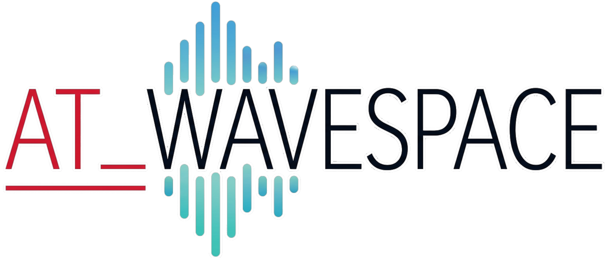
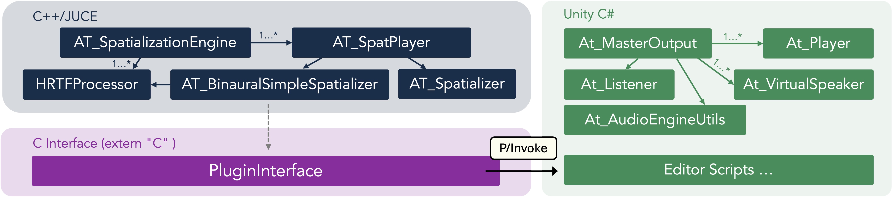

<p align="left">
  
</p>

# Wave Field Synthesis Audio Engine

> High-precision spatial audio for Unity, powered by Wave Field Synthesis.

[](LICENSE)
[](#)
[](#)
[](#)

---

## Overview

**AT WaveSpace** is a native spatial audio engine based on **Wave Field Synthesis (WFS)**, developped by Antoine Gonot 	at the [CNRS LMA](https://www.lma.cnrs-mrs.fr/) laboratory, in Marseille, France.

It enables physically grounded 3D sound field reproduction inside Unity using a high-performance **C++ / JUCE DSP core**, exposed to Unity through a pure **C API** (`extern "C"`) and a **C# wrapper layer**.

The engine targets multi-speaker WFS arrays (line/circle/square or custom configurations) and supports a **Binaural Virtualization** for headphone rendering.

<p align="center">
  
</p>

---

## Features

| Feature | Description |
|---|---|
| **Wave Field Synthesis** | Physically-based spatial rendering over loudspeaker arrays using standart 2.5D driving function, with pre-filter, per-speaker delay and gain|
| **Rendering Continuity over Space** | The Audio engine modify automatically and smoothly the WFS driving function for sources either outside/behind or inside/in front of the virtual loudspeakers array. Time-reversal for focused sources is applied with a blending function and secondary sources regularisation is applied to avoid singularity at the frontiere|
| **Binaural Virtualization** | Monitoring of the loudspeakers array over headphone using per-speaker HRTF convolution. |
| **Simple Binaural mode** | HRTF-based headphone rendering, switchable at runtime |
| **Near-Field Compensation** | Either "Binaural Virtualization and "Simple Binaural" modes can benefit of near-field compensation following the Distance Variation Function (DVF) approach |
| **Real-time DSP** | High-performance C++ / JUCE audio engine, running on a dedicated thread |
| **Dynamic source positioning** | Continuous 3D source position updates from Unity |
| **Multi-channel output** | Supports up to 1024 virtual speakers |
| **Native Unity integration** | Plug-and-play C# API via `At_Player` and `At_MasterOutput` components |
| **Custom speaker configurations** | Save and Load any array loudspeaker geometry from `.json` file |
| **Cross-platform** | Windows (ASIO / WASAPI) and macOS (CoreAudio) |
	
---

## Architecture


<p align="center">
  
</p>


The C++ core compiles to a **dynamic library** (`.dll` / `.dylib`) that Unity loads via P/Invoke. All DSP processing, speaker rendering, and device management happen in the native layer. Unity provides scene geometry and playback control.

---

## Repository Structure

```
at-wavespace-unity-sdk/
├── Unity_WaveSpace/          # Full Unity demo project (Unity 2021+)
│   ├── Assets/
│   │   ├── AT_WaveSpace/     # C# scripts, prefabs, configuration
│   │   └── Plugins/          # Compiled native libraries (macOS / Windows)
│   └── AT_WaveSpace_JUCE/    # JUCE C++ source — compile the lib directly here
│       ├── AT_WaveSpace.jucer          # Projucer project — native library
│       └── AT_WaveSpace_Console.jucer  # Projucer project — standalone console app
├── UnityPackage/
│   └── AT_WaveSpace.unitypackage  # Ready-to-import Unity package
├── docs/
│   ├── images/
│   └── gifs/
└── LICENSE
```

---

## Installation — Unity Package (recommended)

The fastest way to get started is to import the prebuilt `.unitypackage` into your existing Unity project.

### Prerequisites

- Unity **2021.3 LTS** or later
- A multi-channel audio interface with an ASIO (Windows) or CoreAudio (macOS) driver
- A supported speaker array or headphones (for binaural mode)

### Steps

1. **Download** `AT_WaveSpace.unitypackage` from the [`UnityPackage/`](UnityPackage/) folder.

2. In Unity, go to **Assets → Import Package → Custom Package…** and select the downloaded file.

3. Import all assets (scripts, prefabs, native plugins, and configuration files).

4. In your scene, add the **`At_MasterOutput`** component to an empty GameObject. This initialises the audio engine and manages the output device.

5. Add the **`At_Player`** component to any GameObject that should emit spatial audio. Assign an audio clip and set the initial position.

6. Configure the speaker array in **`SpatialConfiguration.json`** (found in `Assets/AT_WaveSpace/`):

```json
{
  "speakerConfig": "Custom",
  "speakerCount": 32,
  "speakerSpacing": 0.185,
  "outputDeviceName": "Your ASIO Device"
}
```

7. Press **Play**. The native DSP core will initialise automatically.

---

## Recompiling the Native Library from Source

The Unity demo project includes the full JUCE C++ source under `Unity_WaveSpace/AT_WaveSpace_JUCE/`. You can recompile the library directly and have the output land in the correct Unity `Plugins/` folder.

### Prerequisites

- [JUCE 7+](https://juce.com/) with **Projucer**
- **Windows:** Visual Studio 2019 or 2022 with C++ Desktop workload; ASIO SDK
- **macOS:** Xcode 13+ with Command Line Tools

### Steps

#### 1. Open the Projucer project

Open `AT_WaveSpace_JUCE/AT_WaveSpace.jucer` in Projucer.

#### 2. Set the JUCE path

In Projucer, go to **File → Global Paths** and point **Path to JUCE** to your local JUCE installation.

#### 3. Configure the exporter

Select the exporter for your platform (Visual Studio or Xcode). Make sure the **Binary Location** points to:

```
../../Assets/Plugins/
```

This ensures the compiled `.dll` / `.dylib` is written directly into the Unity project's plugin folder.

#### 4. Save and open in IDE

Click **Save Project and Open in IDE** in Projucer.

#### 5. Build

- **Windows:** Build in **Release x64** configuration.
- **macOS:** Build the **Release** scheme. For a Universal Binary (Apple Silicon + Intel), set `ARCHS = arm64 x86_64` in Build Settings.

#### 6. Refresh Unity

Back in Unity, click anywhere in the Project window to trigger an asset refresh. Unity will automatically re-import the updated native library.

---

## Console Application

A standalone **console test application** is also included for validating the DSP core without Unity.

Open `AT_WaveSpace_JUCE/AT_WaveSpace_Console.jucer` in Projucer and follow the same build steps as above. The console app initialises the `AudioDeviceManager` directly and is useful for offline corpus generation, calibration, and debugging audio routing.

> **Note (macOS / Windows):** Console apps built with JUCE require a `ScopedJuceInitialiser_GUI` to be instantiated first in `main()`, even when running headlessly.

---

## C# API Reference

### `At_MasterOutput`

Attach to one GameObject per scene. Manages device initialisation, channel routing, and the WFS/Binaural mode.

| Property | Type | Description |
|---|---|---|
| `outputDeviceName` | `string` | Target audio device name |
| `speakerConfig` | `SpeakerConfig` | `Linear32`, `Linear16`, or `Custom` |
| `spatializationMode` | `SpatMode` | `WFS` or `SimpleBinaural` |
| `masterGain` | `float` | Global output gain (linear) |

### `At_Player`

Attach to any sound-emitting GameObject.

| Method | Description |
|---|---|
| `Play()` | Start playback |
| `Stop()` | Stop and rewind |
| `SetPosition(Vector3)` | Update 3D source position in real-time |
| `SetGain(float)` | Per-source gain (linear) |
| `LoadClip(AudioClip)` | Load a new audio file at runtime |

---

## Advanced Configuration

### Speaker Array Geometry

For non-standard arrays, set `speakerConfig` to `Custom` and define your geometry in `SpatialConfiguration.json`:

```json
{
  "speakerConfig": "Custom",
  "speakers": [
    { "index": 0, "x": -2.9675, "y": 0.0, "z": 0.0 },
    { "index": 1, "x": -2.7825, "y": 0.0, "z": 0.0 },
    ...
  ]
}
```

### WFS ↔ Binaural Crossfade

Mode transitions use an equal-power crossfade over a configurable number of blocks, ensuring glitch-free switching at runtime. Set the fade duration via `At_MasterOutput.fadeDurationMs`.

### Near-Field Compensation (NFC)

The WFS renderer includes a Near-Field Compensation filter. The reference distance `rRef` is set in `AT_SpatializationEngine` (default: `3.0 m`). Adjust it to match your listening distance for correct level compensation.

---

## Requirements Summary

| | Windows | macOS |
|---|---|---|
| Compiler | Visual Studio 2019/2022 | Xcode 13+ |
| Audio API | ASIO, WASAPI | CoreAudio |
| Unity | 2021.3 LTS+ | 2021.3 LTS+ |
| Architecture | x64 | x64, Apple Silicon |
| JUCE | 7+ | 7+ |

---

## License

This project is released under the [MIT License](LICENSE).

The DSP algorithms are based on WFS research conducted at **CNRS LMA** (Laboratoire de Mécanique et d'Acoustique), Marseille.

---

## Acknowledgements

- [CNRS LMA](https://www.lma.cnrs-mrs.fr/) — Research foundation for WFS rendering
- [JUCE](https://juce.com/) — Cross-platform C++ audio framework
- KEMAR mannequin measurements — Head-Related Transfer Function (HRTF) dataset

---

*Built by [Antoine Gonot](https://github.com/agonotamu)*
